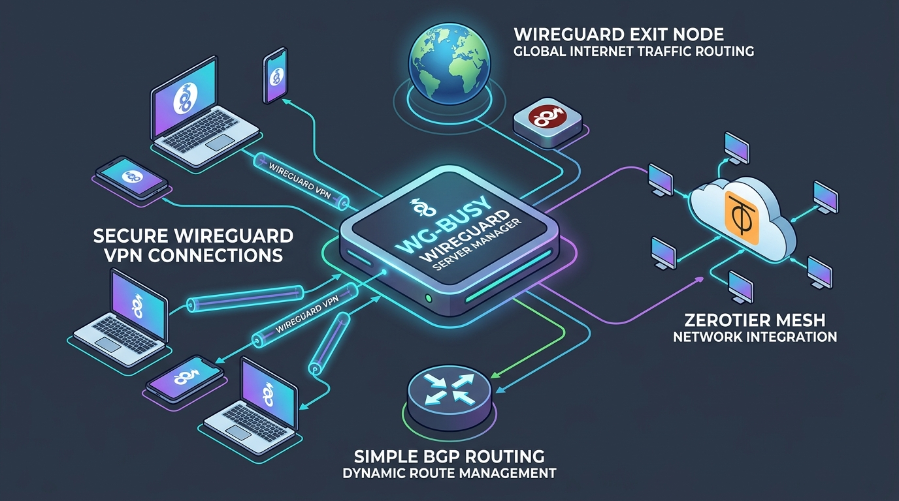
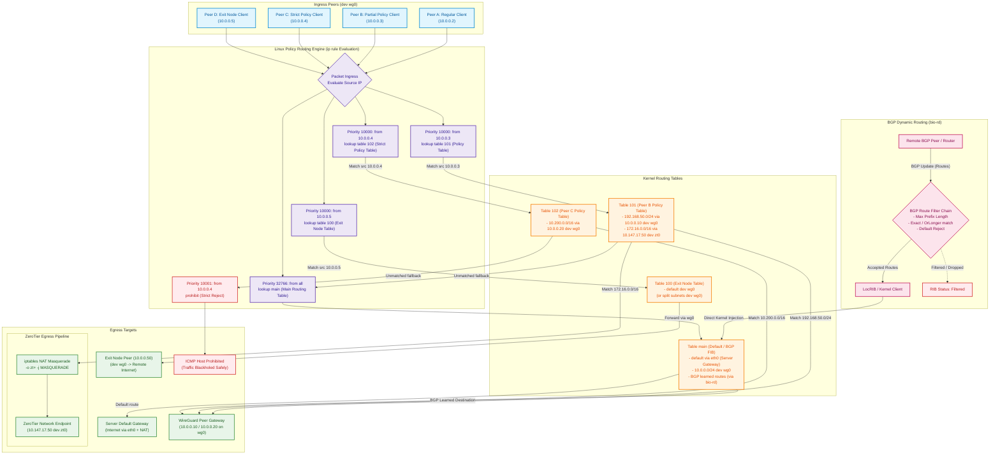
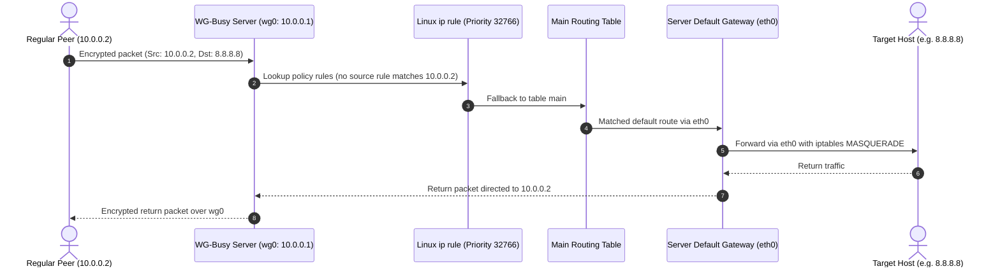
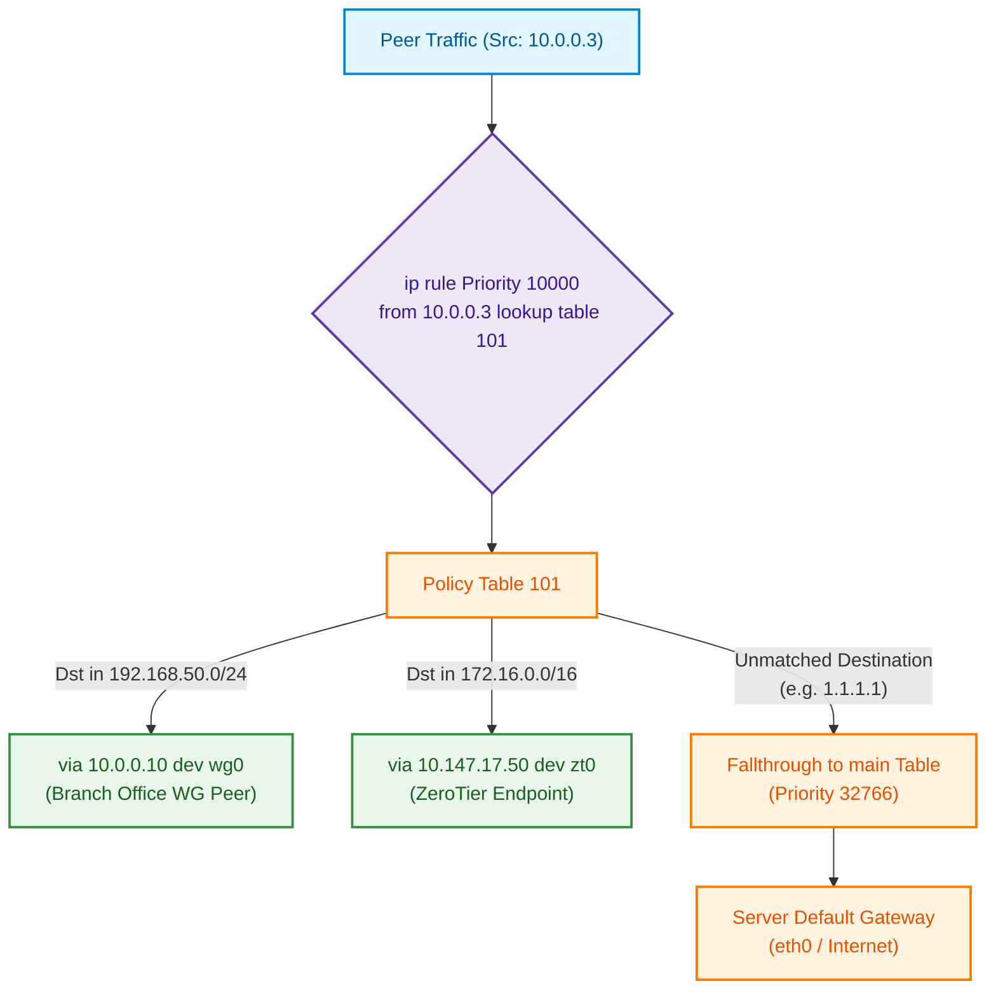
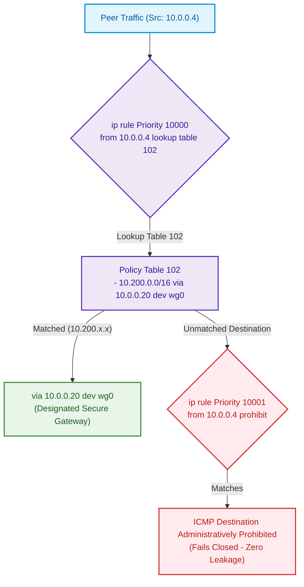
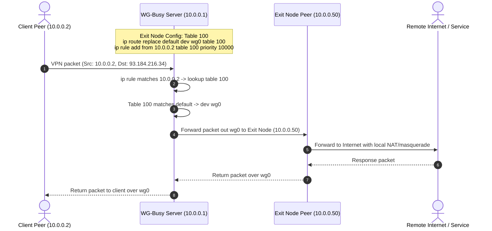
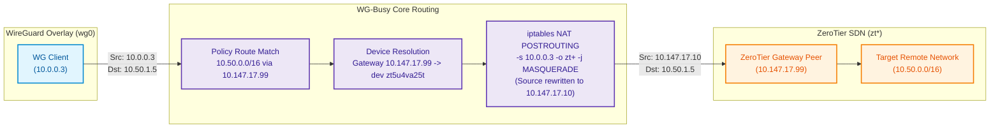
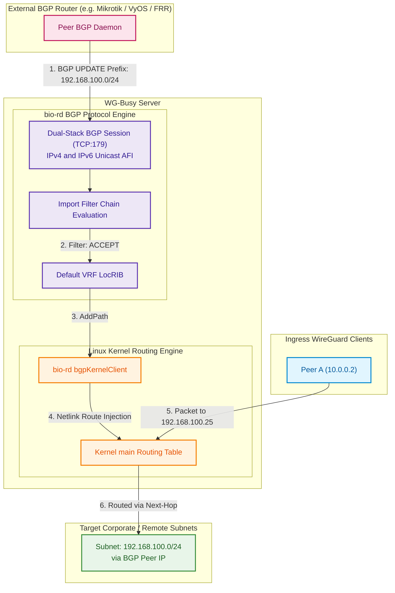
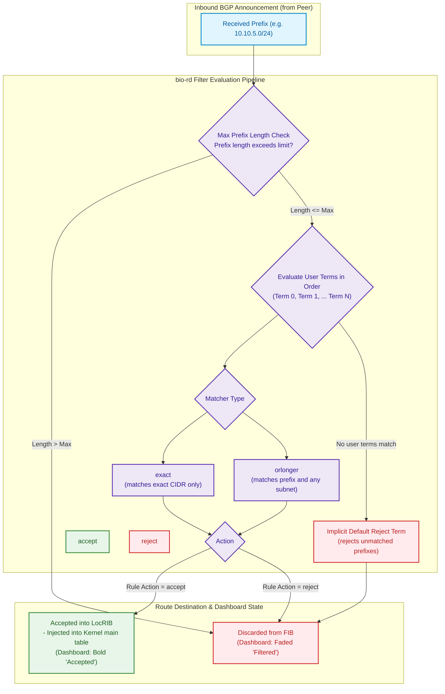

# WG-Busy Routing Capabilities & Architecture Showcase

> **Visual guide and technical deep-dive into WG-Busy's policy routing, dynamic BGP routing, ZeroTier integration, and traffic management.**



### What Can WG-Busy Do? (At a Glance)

WG-Busy serves as a powerful central hub for managing WireGuard VPNs with flexible traffic steering:

* 🔒 **Secure WireGuard VPN**: Connect laptops, smartphones, and remote devices through high-speed encrypted tunnels.
* 🌐 **WireGuard Exit Nodes**: Bounce any client's internet traffic through a designated exit node peer (e.g. a VPS in another region or country).
* ⚡ **ZeroTier Mesh Integration**: Seamlessly route WireGuard clients into ZeroTier networks with automatic NAT masquerading.
* 📡 **Simple BGP Dynamic Routing**: Automatically exchange and inject live network routes with hardware routers (Mikrotik, VyOS, Cisco) and Cloud VPCs.
* 🎯 **Policy & Strict Routing**: Steer specific subnets to specific gateways per client, or lock down contractor peers so unauthorized traffic is safely dropped.

---

## Master Architecture & Detailed Packet Flow

The diagram below illustrates how incoming packets on `wg0` traverse WG-Busy's priority-ordered Linux Policy Routing rules (`ip rule`), custom routing tables, BGP-injected kernel routes, ZeroTier interfaces, and egress gateways.



---

## 1. Regular WireGuard Peer (Server Default Gateway)

### Overview
A standard WireGuard client configuration. Traffic arrives across the `wg0` tunnel interface, has no policy rules targeting its source IP, falls through to the Linux `main` routing table (`priority 32766`), and exits via the host server's default WAN gateway (e.g. `eth0`).



### Configuration Example
```yaml
peers:
  - id: "client-alice"
    name: "Alice Laptop"
    allowedIPs: "10.0.0.2/32"
    clientAllowedIPs: "0.0.0.0/0, ::/0"
    enabled: true
```

---

## 2. Policy Routing

WG-Busy manages Linux Policy Based Routing (PBR) using source routing (`ip rule from <peer_ip>`). Priorities start at `10000` (well below `main` at `32766`), ensuring policy rules are evaluated first.

```
Rule Priority Hierarchy:
  10000: from <peer_ip> lookup <exit_node_table>  (if routing via Exit Node)
  10001: from <peer_ip> lookup <policy_table>     (if custom Policy Routes exist)
  10002: from <peer_ip> prohibit                  (if Strict Policy Routing is enabled)
  ...
  32766: from all lookup main                     (standard kernel routes)
```

---

### 2.1 Partial Policy Routing (Split Subnet Routing)

#### Overview
A peer routes specific destination subnets through designated gateways (which can be other WireGuard peers or ZeroTier hosts), while all other traffic falls through to the server's default gateway.



#### Generated System Commands
```bash
# Injected into wg0 PostUp:
ip rule del priority 10000 2>/dev/null || true; ip rule add from 10.0.0.3 table 101 priority 10000
ip route replace 192.168.50.0/24 via 10.0.0.10 dev wg0 table 101 || true
ip route replace 172.16.0.0/16 via 10.147.17.50 dev zt0 table 101 || true
```

#### Configuration Example
```yaml
peers:
  - id: "client-bob"
    name: "Bob Workstation"
    allowedIPs: "10.0.0.3/32"
    policyRoutingTableID: 101
    policyRoutes:
      - "192.168.50.0/24 via 10.0.0.10"
      - "172.16.0.0/16 via 10.147.17.50"
    strictPolicyRouting: false
    enabled: true
```

---

### 2.2 Full Policy Routing

#### (a) Via Manual Routing Table with Strict Policy Routing (`strictPolicyRouting: true`)

When a peer must be completely isolated to its assigned policy routes, **Strict Policy Routing** adds a trailing `prohibit` rule. Any packet not matching the custom table is rejected with an ICMP Host Prohibited error rather than falling back to the `main` table.



#### Generated System Commands
```bash
ip rule del priority 10000 2>/dev/null || true; ip rule add from 10.0.0.4 table 102 priority 10000
ip rule del priority 10001 2>/dev/null || true; ip rule add from 10.0.0.4 prohibit priority 10001
ip route replace 10.200.0.0/16 via 10.0.0.20 dev wg0 table 102 || true
```

#### Configuration Example
```yaml
peers:
  - id: "client-strict"
    name: "Secure Contractor"
    allowedIPs: "10.0.0.4/32"
    policyRoutingTableID: 102
    policyRoutes:
      - "10.200.0.0/16 via 10.0.0.20"
    strictPolicyRouting: true
    enabled: true
```

---

#### (b) Via Exit Node

Any peer can be configured as an **Exit Node**. Other peers can select it via `exitNodeID`, steering all their outbound internet (or split subnets) through that peer.



#### Exit Node Modes:
* **Full Tunnel (`exitNodeAllowAll: true`)**: Server wg0.conf sets `AllowedIPs = 0.0.0.0/0, ::/0` for the exit peer and installs `default dev wg0 table <ID>`.
* **Split Tunnel (`exitNodeAllowAll: false`)**: Server installs only the specific `exitNodeRoutes` in table `<ID>` and sets `AllowedIPs = <PeerIP>, <Route1>, <Route2>...`.

#### Configuration Example
```yaml
peers:
  # The Exit Node Peer
  - id: "exit-us"
    name: "US Exit Gateway"
    allowedIPs: "10.0.0.50/32"
    isExitNode: true
    exitNodeAllowAll: true
    routingTableID: 100
    enabled: true

  # The Client routing through the Exit Node
  - id: "client-alice"
    name: "Alice Laptop"
    allowedIPs: "10.0.0.2/32"
    exitNodeID: "exit-us"
    enabled: true
```

---

## 3. Routing via ZeroTier Network Endpoint(s)

WG-Busy supervises an embedded `zerotier-one` process, monitors on-link ZeroTier interfaces (`zt*`), pins policy routes to the appropriate ZeroTier device, and applies automated NAT masquerade.



### Key Technical Mechanisms:
1. **Dynamic Gateway Resolution**: `models.DeviceForGateway` matches the gateway IP (`10.147.17.99`) against joined ZeroTier networks and binds the route to `dev zt5u4va25t`.
2. **ZeroTier Egress NAT**: WireGuard source IPs (`10.0.0.3`) are masqueraded behind the WG-Busy node's ZeroTier IP (`iptables -t nat -A POSTROUTING -o zt+ -j MASQUERADE`), ensuring return packets route correctly without remote ZeroTier controllers needing return routes.
3. **Idempotent / Safe Hooks**: ZeroTier policy routes include trailing `|| true` so a temporarily unassigned ZeroTier interface does not break `wg-quick up`.

---

## 4. Routing via Dynamic BGP Received Routes

WG-Busy embeds `bio-rd` to establish dual-stack (IPv4/IPv6) BGP peering sessions over WireGuard tunnels, ZeroTier networks, or physical LANs. Accepted routes are injected directly into the Linux kernel `main` routing table.



---

## 5. BGP Route Filtering Pipeline

WG-Busy provides granular per-peer route filters on both **import** (received prefixes) and **export** (advertised prefixes) chains.



### BGP Configuration Example
```yaml
server:
  bgpEnabled: true
  bgpListenAddress: "::"
  bgpListenPort: 179
  bgpAsn: 64000

bgpPeers:
  - id: "bgp-core-router"
    name: "Core Mikrotik Router"
    peerIP: "10.0.0.10"
    peerPort: 179
    peerAsn: 64001
    connect: false                # Passive listener mode
    redistributeConnected: true   # Advertise WG & ZT subnets with Next-Hop-Self
    maxReceivedPrefixLength: 24   # Drop prefixes smaller than /24
    routeFilters:
      - prefix: "10.10.0.0/16"
        matcher: "orlonger"
        action: "accept"
      - prefix: "192.168.1.0/24"
        matcher: "exact"
        action: "accept"
      - prefix: "10.0.0.0/8"
        matcher: "orlonger"
        action: "reject"
    enabled: true
```

---

## Technical Comparison Matrix

| Routing Capability | `ip rule` Priority | Kernel Table | Egress Dev | Default Gateway Fallback | NAT Behavior |
| :--- | :--- | :--- | :--- | :--- | :--- |
| **Regular WG Peer** | `32766` (`main`) | `main` | `eth0` / WAN | **Yes** (Primary egress) | Host WAN Masquerade |
| **Partial Policy Routing** | `10000+` (`from <peer>`) | Custom Table (e.g. `101`) | `wg0` or `zt*` | **Yes** (Unmatched falls through to `main`) | Device-dependent |
| **Full Policy (Strict)** | `10000` (lookup), `10001` (`prohibit`) | Custom Table (e.g. `102`) | `wg0` or `zt*` | **No** (Unmatched fails closed with ICMP Prohibited) | Device-dependent |
| **Full Policy (Exit Node)**| `10000+` (`from <peer>`) | Exit Table (e.g. `100`) | `wg0` | **No** (All traffic steered to exit peer) | Exit Node handles NAT |
| **ZeroTier Endpoint** | `10000+` (`from <peer>`) | Custom Table (e.g. `101`) | `zt*` device | Configurable (Strict vs Non-Strict) | `iptables -o zt+ -j MASQUERADE` |
| **BGP Dynamic Routes** | `32766` (`main`) | `main` | `wg0` / `zt*` / WAN | **Yes** (Evaluated via LPM in `main`) | Standard routing |
| **BGP Route Filtering** | N/A (Control Plane) | `LocRIB` $\rightarrow$ `main` | N/A | Rejected prefixes never touch kernel FIB | N/A |
