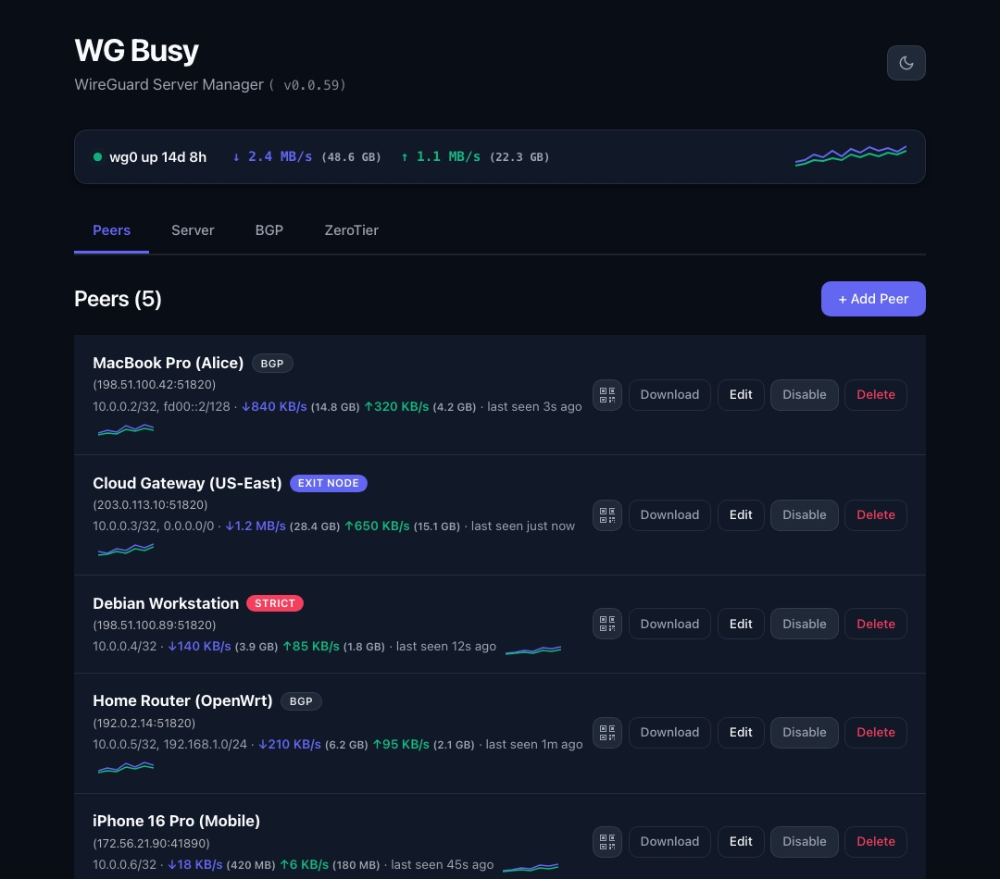
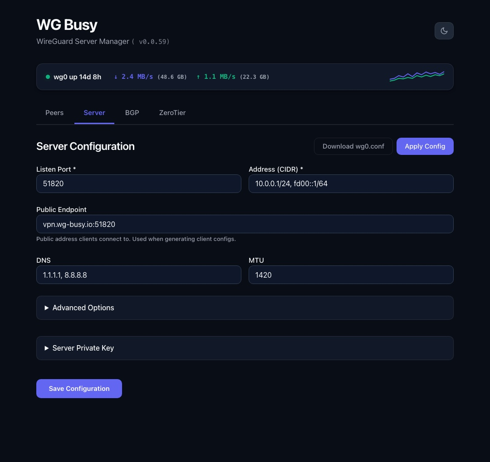
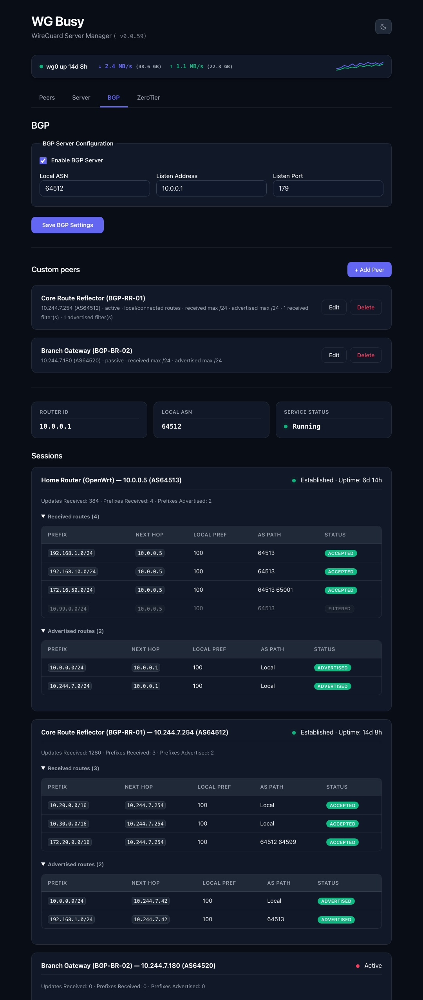
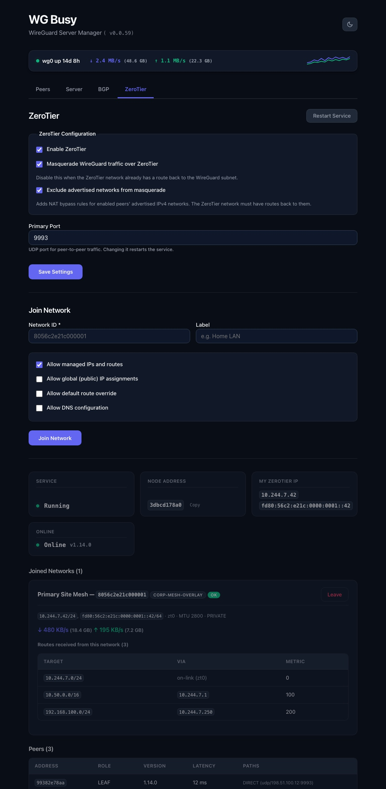
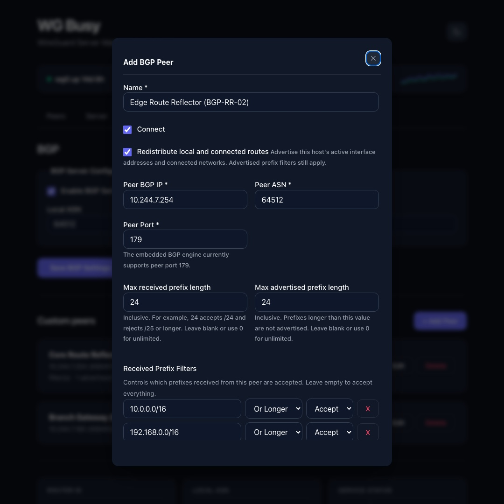

# WG-Busy UI Preview

WG-Busy provides a clean, modern interface for managing your WireGuard server and advanced overlay routing.

## Peers Dashboard
Manage all your WireGuard clients, configure exit nodes, toggle policy routing, and view real-time bandwidth usage.

## Server Configuration
Configure the WireGuard server settings, including BGP overlay enablement, ASN, listen ports, and DNS preferences.

## BGP Statistics
A dedicated dashboard for BGP sessions showing realtime stats on peer uptimes, received prefixes, and exactly which routes were accepted or filtered.

## ZeroTier Management
Run the managed ZeroTier client, join networks, inspect service and network status, and troubleshoot networks that have not joined.

## BGP Peer Configuration
Define custom standalone BGP peers or route reflectors with connection initiation controls, local route redistribution, prefix length boundaries, and fine-grained import/export prefix filtering.

