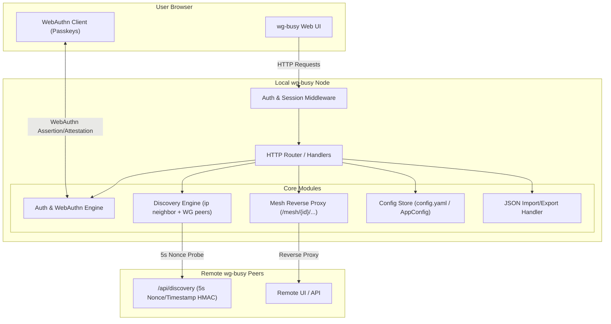

# Implementation Plan: Access Tab, Password & Passkeys (WebAuthn), Discovery & Mesh Federation, and Unified JSON Config Import/Export

Implement the **Access Tab**, **Authentication & Passkey Management (WebAuthn)**, **LAN/WireGuard Federated Discovery Engine**, **Federated Mesh Server Proxy**, and **Unified JSON Server Configuration Import/Export**.

---

## Architecture & Design Overview



---

## 1. Component Design

### 1.1 Data Models & Unified JSON Schema (`internal/models`)
All configuration remains unified in the `models.AppConfig` struct, fully serializable to both YAML (`config.yaml`) and JSON for single-file import/export.

```go
type AppConfig struct {
    Server   ServerConfig   `yaml:"server" json:"server"`
    Peers    []Peer         `yaml:"peers" json:"peers"`
    BGPPeers []BGPPeer      `yaml:"bgpPeers,omitempty" json:"bgpPeers,omitempty"`
    ZeroTier ZeroTierConfig `yaml:"zerotier,omitempty" json:"zerotier,omitempty"`
    Access   AccessConfig   `yaml:"access,omitempty" json:"access,omitempty"`
}

type AccessConfig struct {
    DiscoveryEnabled bool         `yaml:"discoveryEnabled" json:"discoveryEnabled"`
    ServerName       string       `yaml:"serverName,omitempty" json:"serverName,omitempty"` // Name used for discovery (defaults to os.Hostname())
    AdminPassword    string       `yaml:"adminPassword,omitempty" json:"adminPassword,omitempty"`
    Passkeys         []Passkey    `yaml:"passkeys,omitempty" json:"passkeys,omitempty"`
    MeshServers      []MeshServer `yaml:"meshServers,omitempty" json:"meshServers,omitempty"`
}

type Passkey struct {
    ID          string    `yaml:"id" json:"id"`                      // Base64-encoded Credential ID
    Name        string    `yaml:"name" json:"name"`                  // User-assigned label (e.g. "MacBook Pro TouchID")
    PublicKey   string    `yaml:"publicKey" json:"publicKey"`        // Base64-encoded COSE / PKIX public key
    SignCount   uint32    `yaml:"signCount" json:"signCount"`        // Monotonic counter against replays
    AAGUID      string    `yaml:"aaguid,omitempty" json:"aaguid,omitempty"`
    CreatedAt   time.Time `yaml:"createdAt" json:"createdAt"`
    LastUsedAt  time.Time `yaml:"lastUsedAt,omitempty" json:"lastUsedAt,omitempty"`
}

type MeshServer struct {
    ID        string    `yaml:"id" json:"id"`               // Unique server ID
    Name      string    `yaml:"name" json:"name"`           // User-assigned server name
    Endpoint  string    `yaml:"endpoint" json:"endpoint"`   // e.g. "http://192.168.1.50:8080"
    CreatedAt time.Time `yaml:"createdAt" json:"createdAt"`
    UpdatedAt time.Time `yaml:"updatedAt" json:"updatedAt"`
}

type DiscoveredPeer struct {
    IP       string `json:"ip"`
    Port     uint16 `json:"port"`
    Name     string `json:"name"`
    Status   string `json:"status"` // "unlocked", "locked", "no_password"
    InMesh   bool   `json:"inMesh"` // whether already present in meshServers
}
```

---

### 1.2 Access Tab Configuration
The Access tab settings form includes:
- **Server Name**: Name advertised in discovery responses to federated peers (fallback to system hostname if unset).
- **Enable Discovery**: On/Off toggle switch.
- **Admin Password**: Password field with set/update/remove capability.
- **Passkeys Management**: List of registered passkeys with Name, Created Date, Last Used, and Rename/Delete buttons, plus "+ Add Passkey" button.
- **Peer Discovery Section**: "Discover peers" button, loading state (5s scan), and Discovered Peers table with locked/unlocked indicators and "+ Add to Mesh" buttons.
- **Mesh / Federated Servers Table**: Table of federated nodes, edit/remove buttons, and "Open Server" link navigating to `/mesh/{id}/`.

---

### 1.3 Unified JSON Configuration Import & Export (Server Tab)
- **Export JSON Endpoint (`GET /api/config/export`)**:
  - Exports the complete `AppConfig` (Server, Peers, BGP, ZeroTier, Access/Passkeys/Mesh) as a clean, indented JSON file with attachment header `filename="wg-busy-config.json"`.
- **Import JSON Endpoint (`POST /api/config/import`)**:
  - Accepts multipart JSON file upload or JSON body.
  - Validates all configuration sections (`Server`, `Peers`, `BGPPeers`, `ZeroTier`, `Access`).
  - Atomically writes to `Store` and persists to `config.yaml`.
  - Automatically re-renders `wg0.conf` and reapplies live WireGuard, BGP, and ZeroTier services.
  - Emits toast feedback and updates the UI via HTMX out-of-band swaps.
- **Server Tab UI**:
  - Add **"Export JSON"** and **"Import JSON"** buttons alongside the existing "Download wg0.conf", "wg show", and "Apply Config" buttons.
  - Include file upload modal for JSON import with clear validation feedback.

---

### 1.4 Authentication & WebAuthn / Passkeys Engine (`internal/auth`)
- **Session Management**:
  - Cryptographically secure 256-bit session tokens stored in an in-memory session cache with TTL (7 days).
  - Set in `HttpOnly`, `SameSite=Lax`, `Path=/` session cookie (`wg_busy_session`).
- **Password Authentication**:
  - If `AdminPassword` is configured, protects all UI routes and mutating API endpoints.
  - If `AdminPassword` is NOT set and no passkeys exist, authentication is bypassed.
- **Passkeys (WebAuthn)**:
  - Implements W3C WebAuthn Level 2 / Level 3 registration and authentication protocol:
    - Challenge generation stored in short-lived challenge cache (5 min TTL).
    - `POST /api/auth/passkey/register/begin` & `POST /api/auth/passkey/register/finish`
    - `POST /api/auth/passkey/login/begin` & `POST /api/auth/passkey/login/finish`
  - Verifies ES256 / RS256 signature, client data JSON, and authenticator data flags (User Present `UP`, User Verified `UV`).
- **Post-Login Passkey Onboarding**:
  - After entering the admin password successfully on `/login`, if WebAuthn is supported on the client device and the user hasn't registered a passkey on this device yet, a prompt/dialog appears: *"Set up a Passkey on this device for faster sign-in? Enter a name: [My Laptop] [Create Passkey] [Skip]"*.
- **Passkeys Management on Access Tab**:
  - Rename passkey.
  - Delete passkey.
  - Add additional passkey.

---

### 1.5 Discovery Protocol & Anti-Bruteforce Verification (`internal/discovery`)
- **Discovery Endpoint (`/api/discovery`)**:
  - Can be queried via `GET` or `POST` by other nodes in the mesh.
  - **Fixed 5-Second Duration**: Every execution (valid, invalid, or disabled) enforces an artificial sleep until exactly 5.0 seconds have elapsed from request arrival to prevent timing attacks and rate-limit brute-force attempts.
  - **Cryptographic Hash Verification**:
    - Query/Payload parameters: `nonce` (32-character random hex) and `hash` (hex-encoded HMAC-SHA256).
    - Floor current UTC timestamp to the nearest minute:
      $$\text{TimestampMinute} = \lfloor \text{time.Now().Unix()} / 60 \rfloor \times 60$$
    - Expected HMAC is calculated as:
      $$\text{ExpectedHash} = \text{HMAC-SHA256}(\text{AdminPassword}, \text{nonce} + ":" + \text{TimestampMinute})$$
    - Also validates $t \pm 60\text{s}$ to tolerate clock drift between servers.
  - **Responses**:
    - Discovery disabled in config $\to$ 404 Not Found / 403 Forbidden after 5s.
    - No password configured on node $\to$ `{"status": "no_password", "name": "<ServerName>"}`
    - Password configured & hash matches $\to$ `{"status": "unlocked", "name": "<ServerName>"}`
    - Password configured & hash does not match $\to$ `{"status": "locked", "name": ""}`
- **Active Discovery Scanner**:
  - Triggered via *"Discover peers"* button (`POST /access/discover`).
  - Collects target candidate IPs:
    1. Runs `ip neighbor show` and parses all IPv4 and IPv6 neighbor addresses (including `STALE`, `REACHABLE`, `DELAY`, etc.).
    2. Gathers all configured WireGuard peer IP addresses (`AllowedIPs` and endpoints).
  - Deduplicates and removes local interface IPs.
  - Dispatches parallel discovery probes to candidates with timeout (6.5s).
  - If local node has an admin password configured, computes the HMAC-SHA256 hash using the local password and a fresh random nonce.
  - Returns the list of discovered peers with:
    - Host IP / port
    - Host name
    - Password status: **Unlocked** (green badge/icon), **Locked** (amber lock icon), or **No Password** (gray badge)
    - Action button: *"Add to Mesh"*

---

### 1.6 Federated Mesh Table & Reverse Proxy (`internal/handlers`)
- **Mesh Table**:
  - Stored in `AppConfig.Access.MeshServers`.
  - Lists each federated server with its Name, Endpoint, and an *"Open Server"* action.
- **Reverse Proxy Route (`/mesh/{id}/*`)**:
  - `httputil.NewSingleHostReverseProxy` mounted at `/mesh/{id}/`.
  - Transparently forwards all subpath requests to the target federated node's endpoint.
  - Strips the prefix `/mesh/{id}` when sending the request to the upstream peer.
  - Rewrites `Location` header on redirects to keep browser navigation within `/mesh/{id}/...`.
  - Ensures clean cookie and path forwarding.
- **Arbitrary HTTP Path Prefix Support**:
  - All web assets, HTMX requests, and Handlebars templates use relative paths (e.g. `peers`, `stats`, `server`, `templates.html`, `index.css`).
  - Added HTML `<base>` or strict relative resolution ensuring that when the UI is loaded at `/mesh/{id}/` (or any reverse proxy subpath), all fetch and HTMX calls stay within that subpath automatically.

---

### 1.7 UI & Templates (`web/`)
- **Main Navigation**:
  - Add `Access` tab button (`hx-get="access"`).
- **Access Tab View (`access-template`)**:
  - **Server Name**: Text input for advertised discovery name.
  - **Discovery Settings**: Toggle *"Enable discovery"*.
  - **Admin Password**: Form to update or set admin password.
  - **Passkeys Management**: List of registered passkeys with Name, Created Date, Last Used, and Rename/Delete buttons, plus "+ Add Passkey" button.
  - **Peer Discovery Section**: "Discover peers" button, loading spinner (5s scan), and Discovered Peers table with locked/unlocked indicators and "+ Add to Mesh" buttons.
  - **Mesh / Federated Servers Table**: Table of federated nodes, edit/remove buttons, and "Open UI" link navigating to `/mesh/{id}/`.
- **Server Tab View (`server-config-template`)**:
  - Add **"Export JSON"** and **"Import JSON"** buttons with import modal dialog.
- **Login Page (`web/login.html` / `login-template`)**:
  - Complies with `index.css` styling and dark/light theme toggle.
  - Password sign-in form.
  - "Sign in with Passkey" button (triggers browser WebAuthn API).
  - Modal prompt for Passkey registration upon initial password sign-in.

---

## 2. Proposed File Changes

### Backend (`internal/`)

#### [NEW] [internal/auth/auth.go](file:///Users/alexm/Work/oo2/wg-busy/internal/auth/auth.go)
- Session manager (cryptographically secure tokens, expiration, cookie helpers).
- WebAuthn registration/login challenge generator & cryptographic validator (ES256, RS256, signature verification, sign count tracking).
- Password validation and constant-time comparison.

#### [NEW] [internal/auth/auth_test.go](file:///Users/alexm/Work/oo2/wg-busy/internal/auth/auth_test.go)
- Unit tests for session issuance, expiration, password checking, and WebAuthn signature parsing.

#### [NEW] [internal/discovery/discovery.go](file:///Users/alexm/Work/oo2/wg-busy/internal/discovery/discovery.go)
- LAN neighbor scanner (`ip neighbor show` parsing with unit-testable shell runner).
- WireGuard peer IP collector.
- Cryptographic hash generator/validator with timestamp flooring and nonce.
- Parallel prober and 5-second fixed delay responder with server name payload.

#### [NEW] [internal/discovery/discovery_test.go](file:///Users/alexm/Work/oo2/wg-busy/internal/discovery/discovery_test.go)
- Unit tests for `ip neighbor show` parsing, HMAC calculation with time drift, 5s delay enforcement, and probe aggregation.

#### [MODIFY] [internal/models/models.go](file:///Users/alexm/Work/oo2/wg-busy/internal/models/models.go)
- Add `AccessConfig` (including `ServerName`, `DiscoveryEnabled`, `AdminPassword`, `Passkeys`, `MeshServers`), `Passkey`, `MeshServer`, `DiscoveredPeer` structs, cloning logic, JSON tags across all structs, and validation rules.

#### [MODIFY] [internal/models/models_test.go](file:///Users/alexm/Work/oo2/wg-busy/internal/models/models_test.go)
- Tests for `AccessConfig` cloning, validation, and JSON serialization/deserialization.

#### [NEW] [internal/handlers/access.go](file:///Users/alexm/Work/oo2/wg-busy/internal/handlers/access.go)
- HTTP handlers for Access tab (`GET /access`, `PUT /access/settings`, `POST /access/discover`).
- Passkey management (`POST /access/passkeys/add`, `PUT /access/passkeys/{id}`, `DELETE /access/passkeys/{id}`).
- Mesh management (`POST /access/mesh`, `PUT /access/mesh/{id}`, `DELETE /access/mesh/{id}`).
- Login, session check, and WebAuthn endpoints (`/login`, `/api/auth/login`, `/api/auth/logout`, `/api/auth/passkey/*`).
- Discovery API endpoint (`/api/discovery`).
- Reverse proxy handler for federated mesh (`/mesh/{id}/*`).

#### [MODIFY] [internal/handlers/export.go](file:///Users/alexm/Work/oo2/wg-busy/internal/handlers/export.go)
- Add `ExportJSONConfig` (`GET /api/config/export`) and `ImportJSONConfig` (`POST /api/config/import`).

#### [MODIFY] [internal/handlers/handlers.go](file:///Users/alexm/Work/oo2/wg-busy/internal/handlers/handlers.go)
- Register new routes, auth middleware, and reverse proxy in `NewRouter`.

#### [MODIFY] [internal/handlers/handlers_test.go](file:///Users/alexm/Work/oo2/wg-busy/internal/handlers/handlers_test.go)
- Tests for auth protection, discovery endpoint responses, mesh proxy routing, Access tab endpoints, and JSON import/export round-trip.

---

### Frontend (`web/`)

#### [MODIFY] [web/index.html](file:///Users/alexm/Work/oo2/wg-busy/web/index.html)
- Add "Access" tab button in the header tab bar.
- Add WebAuthn JavaScript client helper functions (`startPasskeyRegistration`, `startPasskeyLogin`).
- Support handling session expiry / redirect.

#### [MODIFY] [web/templates.html](file:///Users/alexm/Work/oo2/wg-busy/web/templates.html)
- Add `access-tab-template` (Server name, Discovery settings, password update form, Passkeys table, Discovery scan button & results table, Mesh servers table).
- Add `passkey-row-template`, `passkey-edit-modal-template`, `mesh-server-modal-template`.
- Add `passkey-onboarding-modal-template`.
- Add `login-page-template` / login view.
- Update `server-config-template` with "Export JSON" and "Import JSON" modal and buttons.

#### [MODIFY] [web/index.css](file:///Users/alexm/Work/oo2/wg-busy/web/index.css)
- Add styles for login card, passkey badges, lock/unlock discovery status icons, JSON import modal, and mesh table actions.

---

## 3. Verification Plan

### Automated Tests
```bash
# Run all unit tests across the entire repository
go test -v ./...

# Specifically run auth, discovery, JSON import/export, and handler tests
go test -v ./internal/auth
go test -v ./internal/discovery
go test -v ./internal/models
go test -v ./internal/handlers
```

### Manual Verification
1. **Access Tab Settings**:
   - Navigate to Access tab, set "Server Name", toggle "Enable discovery", set admin password.
2. **Unified JSON Config Import/Export**:
   - Click "Export JSON" on the Server tab to download `wg-busy-config.json`.
   - Verify it contains all server settings, peers, BGP, ZeroTier, and Access/Passkeys/Mesh config.
   - Click "Import JSON", upload a modified configuration, and verify atomic apply and live reloading.
3. **Authentication Flow**:
   - In private browsing window, verify unauthenticated access redirects to `/login`.
   - Log in with admin password.
   - Verify passkey onboarding prompt appears.
   - Register a passkey (WebAuthn), log out, and log back in using only the passkey.
4. **Passkey Management**:
   - Rename a passkey, add another passkey, and delete a passkey from the Access tab.
5. **Peer Discovery (5s Nonce/HMAC)**:
   - Click "Discover peers".
   - Verify discovery takes 5 seconds.
   - Verify responding peers advertise configured "Server Name".
   - Verify mock/active LAN and WG peers respond with appropriate locked/unlocked/no_password status.
6. **Mesh Federation & Reverse Proxy**:
   - Add a discovered or manual server to the Mesh table.
   - Click "Open Server" and verify it loads the remote server's UI proxied through `/mesh/{id}/`.
   - Verify all sub-requests (stats, peers, server config) use relative paths and function seamlessly under the proxy prefix.
